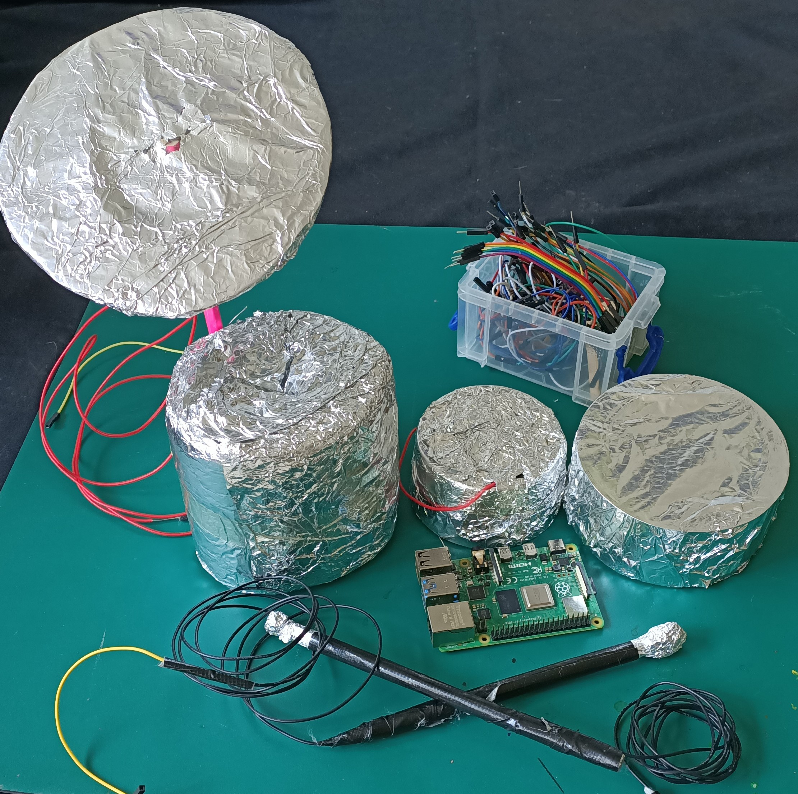

## Introduction

In this project, you’ll learn how to connect several different inputs to your GPIO pins to create a drum kit, or other musical instrument of your choice.

You’ll connect several ‘buttons’ to your Pi to act as inputs that will trigger sounds, then design a physical instrument which you can use and play!

### What you will make

A musical instrument can be anything that takes a user's input and turns it into sounds. You could make anything at all that does this! Consider all of the musical instruments you know and think about how you might copy the way they work using simple inputs.

--- print-only ---
This is what a finished drum kit looks like!

--- /print-only ---

--- no-print ---
Here are some other musical instruments to give you inspiration:

'Scratchivarius' Violin:
<iframe width="560" height="315" src="https://www.youtube.com/embed/Xlz1zBw-rSU" title="YouTube video player" frameborder="0" allow="accelerometer; autoplay; clipboard-write; encrypted-media; gyroscope; picture-in-picture" allowfullscreen></iframe>
In this example the 'bow' is acting as the ground for the strings, which are made from conductive thread and are connected to the Raspberry Pi's GPIO pins.

Raspberry Pi Guitar Hero:
<iframe width="560" height="315" src="https://www.youtube.com/embed/_1OzwwUXGtw" title="YouTube video player" frameborder="0" allow="accelerometer; autoplay; clipboard-write; encrypted-media; gyroscope; picture-in-picture" allowfullscreen></iframe>
In this example the buttons on the guitar's neck choose the note, and touching the 'pick' to the contact on the body the volume is changed from 0% to 100% and back again when removed.

--- /no-print ---

--- collapse ---
---
title: What you will need
---
### Hardware

+ Raspberry Pi
+ At least 5x f-f jumper wires
+ Aluminium foil
+ Strong tape
+ Cardboard (or other drum-shaped items you can cover with foil)
+ Scissors or Craft Knife
+ Glue

#### Optional:
+ Markers
+ Wire spool
+ Wire cutters

### Software

+ Scratch 3 Desktop Version

--- /collapse ---

--- collapse ---
---
title: What you will learn
---

+ Connecting multiple inputs to your Raspberry Pi
+ Creating simple buttons using household items
+ Link inputs to trigger on-screen events and sounds

--- /collapse ---

--- collapse ---
---
title: Additional information for educators
---

You can download the completed project [here](http://rpf.io/p/en/drumkit-get){:target="_blank"}.

If you need to print this project, please use the [printer-friendly version](https://projects.raspberrypi.org/en/projects/scratchpc-musical-instrument/print){:target="_blank"}.

--- /collapse ---
