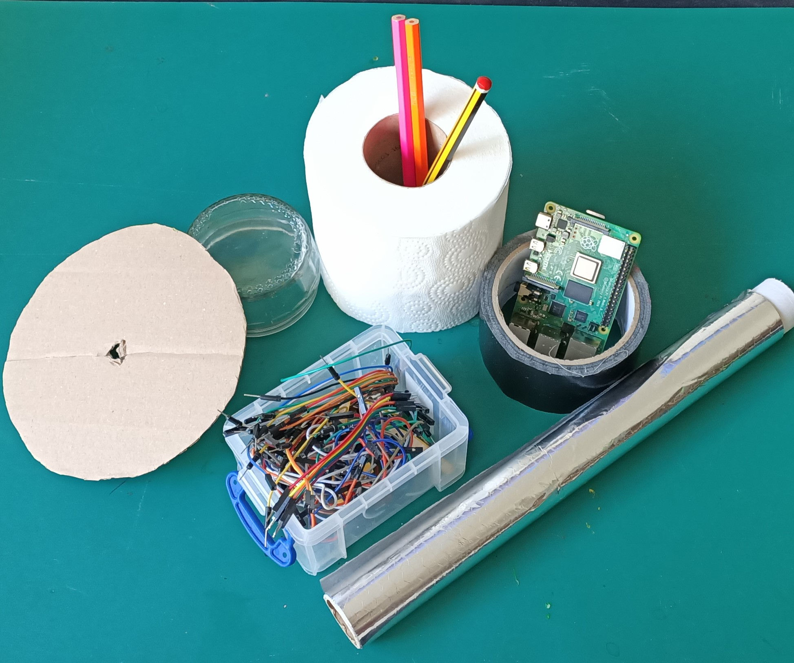
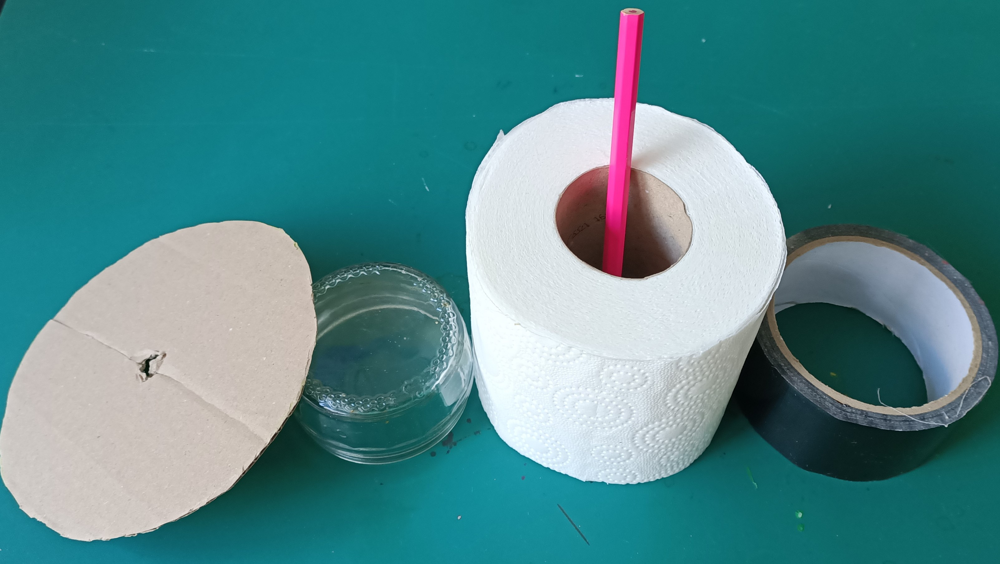
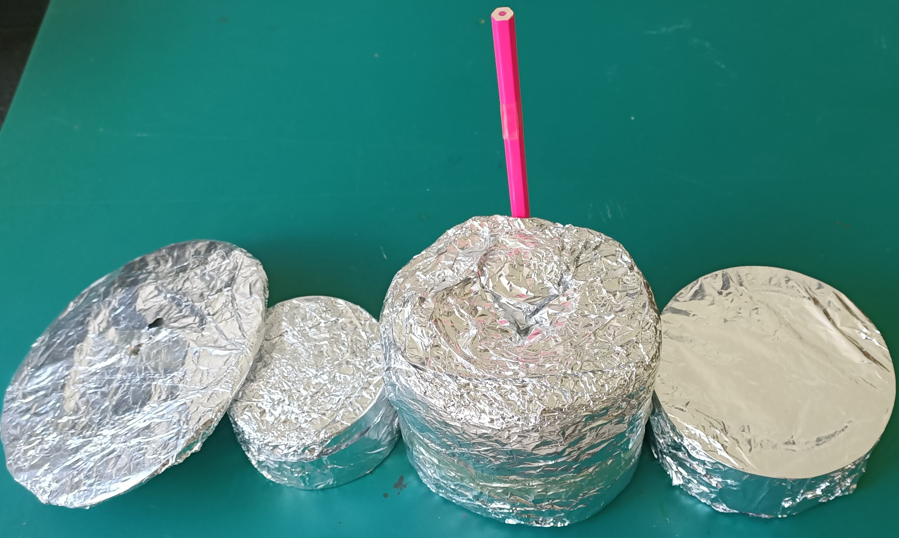
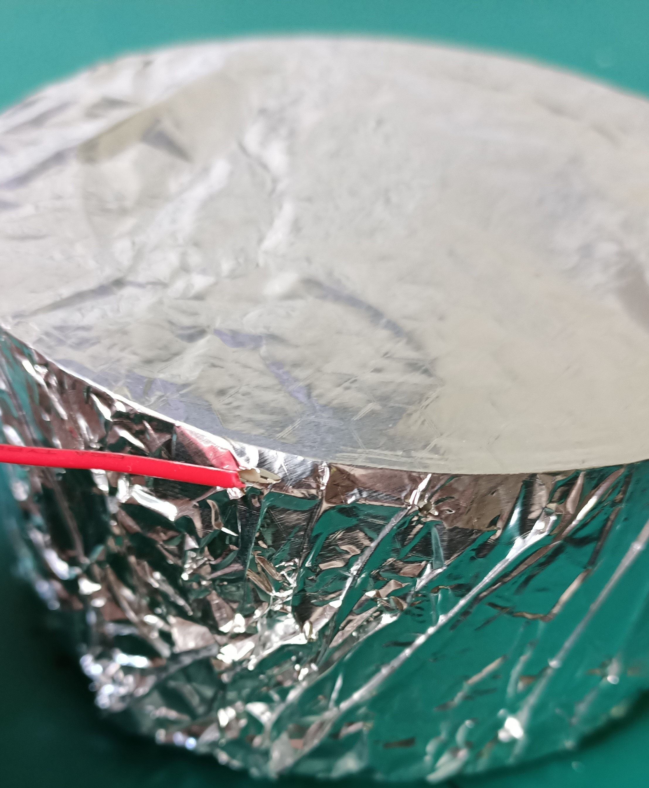
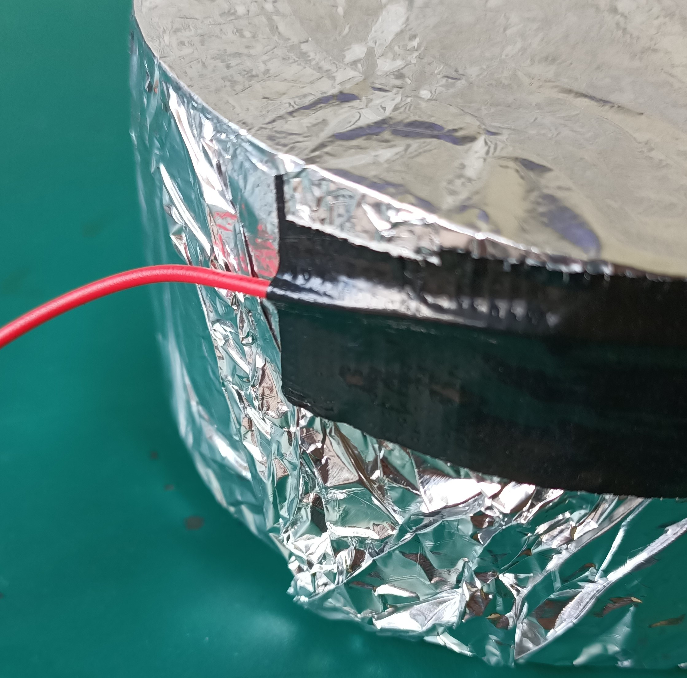
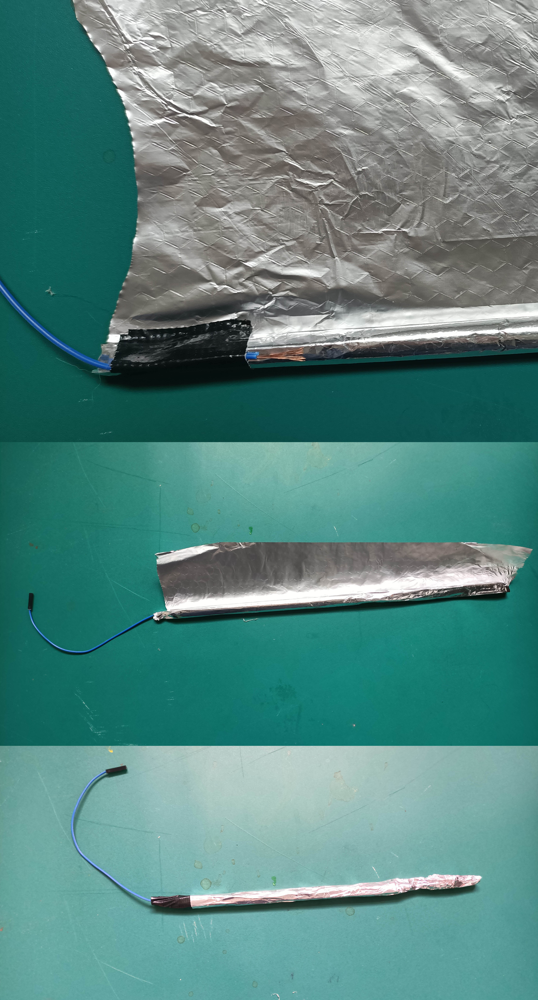

## Make your instrument

By the end of this step, you will have designed and built your instrument's physical components — the body, contacts, and wiring. 

The first step in making a musical instrument is to think about what kind of instrument you’d like to make, and what is possible. It’s important to consider **how** your instrument will be played to determine whether it will work or not.

Your instrument could be based on 'buttons' like the ones you used in the challenge projects; you might use actual buttons, or you could use any sort of conductive contacts that will close a circuit (such as two pieces of aluminium foil). 

An easy way to make a lot of buttons that are all interactive is to use whatever item the player uses (for example, a bow, pick, or drumstick) as the common ground contact for all the circuits. That way, whenever the player touches the instrument with the item, this will close an open circuit and trigger a set event. An advantage of this approach is that you only need to wire up one ground pin (or maybe two) for your whole project, minimising the number of wires you need to use!

In this example, I’ll be making a drum kit. I chose a drum kit because it’s really easy to make the drumsticks act as the ground contacts, which the player uses to make the sounds. That way, whenever a drum — any drum — is touched with a drumstick, that ciruit will be closed and that drum sound will be triggered.

You can make whatever instrument you like, but you need to consider how your player will close the contacts or press the buttons. (Using actual buttons like the ones you can get from electronics shops might be a good option for instruments like pianos or guitars.)

--- task ---
Consider how many pins you need to close your circuits — it will likely be one GPIO pin for each different sound you want to make.

In the example drum kit, there is a kick drum, a floor tom, a snare drum, and a cymbal — that’s four drums. To make the drum kit work, I’ll need four GPIO pins (one for each drum) and one or two ground pins (depending on if I want one or two drumsticks for the player to hold). 

--- /task ---

--- task ---
Look at the materials you have available, and work out how to create the physical parts of your instrument. You might want to cut a shape out of cardboard, or use existing items and stick them together to make the body of your instrument. 

To make my drum kit, I used some simple items I found in the workshop and just covered them in foil. For the guitar and violin, I used some old packing foam I had lying around and some conductive thread left over from another project. Be creative in recycling materials for your instrument!

--- /task ---

Once the instrument body is made, you need to add foil contacts to it to enable the player to 'play' the instrument. One way is to use small pieces of foil that you glue onto the instrument in the right places. A drum kit needs drumsticks as well. Below, you can see how I wrapped pencils in foil and taped them up, making sure the wire is touching a good amount of the foil.

--- task ---
Take each of your F-F jumper wires and remove **one** of the connectors by pulling it off the end. It might take a little strength to remove it. You’re going to use the exposed end of the jumper wire by attaching it to your instrument’s contacts using tape. 
--- /task ---

To make the drum kit here, I used aluminium foil to wrap a toilet roll, a roll of tape, a jar lid, and a piece of cardboard cut into a circle. Because the drums in the example are completely covered in conductive foil, I just poked the wires through the foil and then taped them to the side. 

--- task ---
Attach the exposed ends of your wires **underneath** the foil contacts, ensuring they have a good amount of connection to the foil, and tape them down well.

--- /task ---

--- task ---
Once your instrument body is complete, think about how your player will close the circuits. What will they hold or wear as a contact to close the circuit? Or does your instrument have self-contained player contacts, such as buttons you might find in an electronics kit? 
--- /task ---

In the drum kit example, the player holds the drumsticks, which are simply pencils wrapped in aluminium foil, and connected by a wire to a ground pin, which closes the circuit and activates the drum. 

Other kinds of instruments will need clever solutions to this problem; a cardboard piano may use foil buttons for keys (like you made in previous projects), or have some type of contact the player can wear on their fingers, for example. 

The violin example shown previously uses a 'bow' made with conductive thread, and the guitar has a 'pick' which sets the volume to zero if it isn't touching the contact on the body of the instrument.

--- task ---
To make a drumstick, pull the end off an F-F wire and glue or tape it down firmly to your base item, with the free end hanging toward the user's grip. Wrap the base item in aluminium foil and glue or tape it down.

--- /task ---

--- task ---
Create your instrument’s interface by making something that the player can touch to the instrument contacts and close the circuits you have created. Make sure they are not touching one another, or you'll get a short circuit!
--- /task ---

In the next step, you will connect our instruments to the GPIO pins and code them to make sounds and animations on screen!

--- save ---
