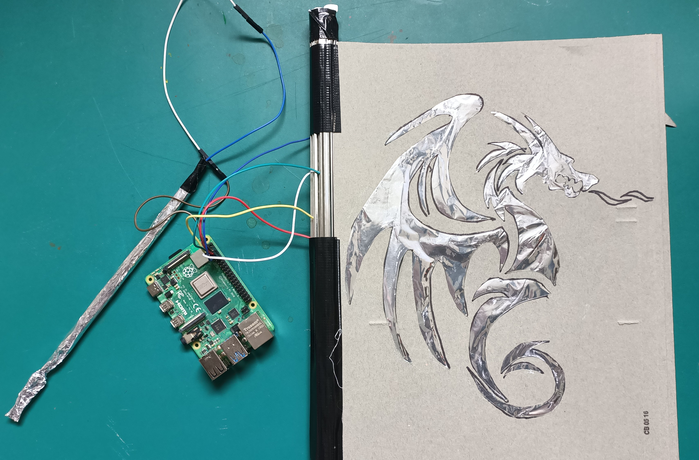

## What next?

If you are following the [Scratch Physical Computing 1](https://projects.raspberrypi.org/en/pathways/physical-computing-with-scratch) pathway, you can move on to the [Interactive Book](https://projects.raspberrypi.org/en/projects/scratchpc-interactive-book) project. In this project, you will make an interactive book which has animations and sounds on screen to accompany a story!

If you want to have more fun exploring Scratch, then you could try out any of [these projects](https://projects.raspberrypi.org/en/projects?software%5B%5D=scratch&curriculum%5B%5D=%201).
